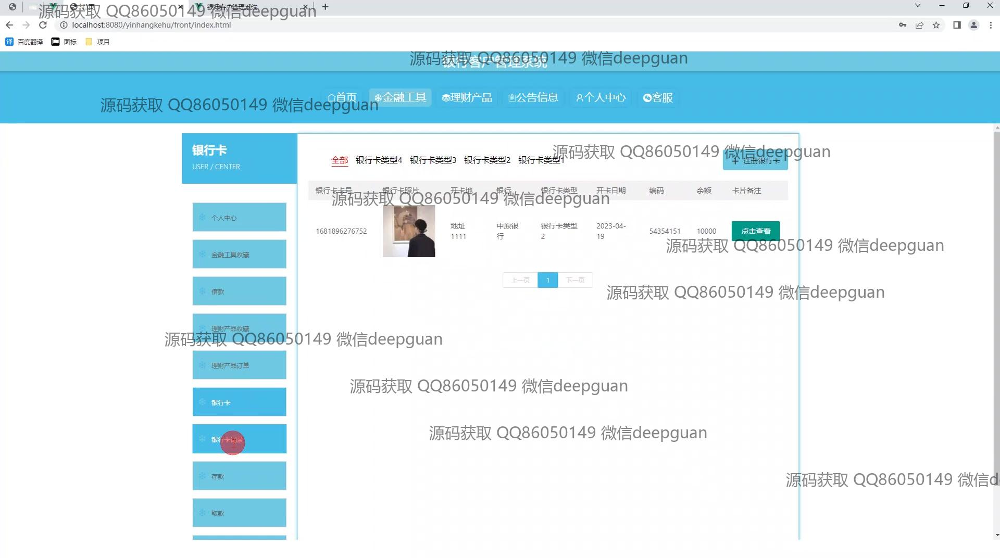
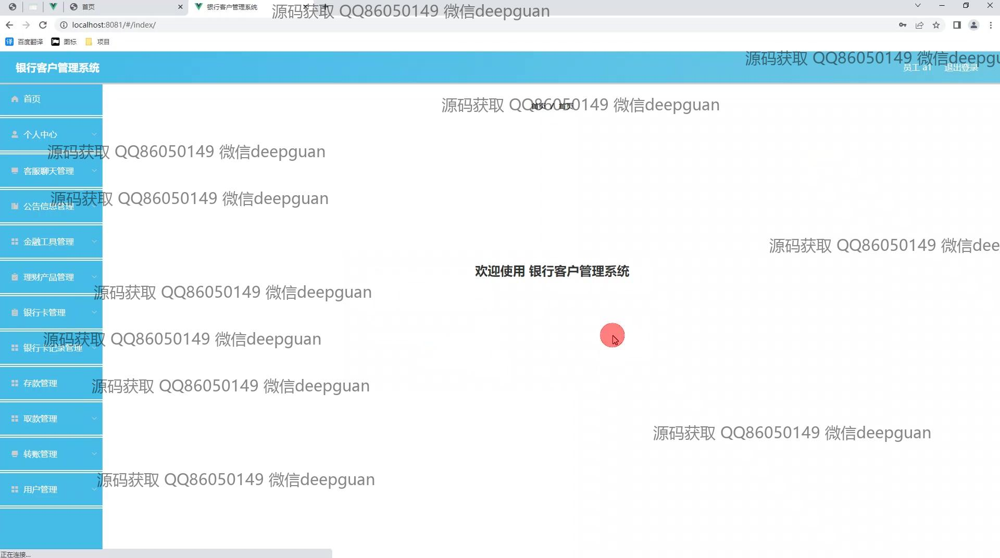

<h1 align="center">银行客户管理系统</h1>

## 简介
银行客户管理系统：分为管理员和用户两角色，功能包括用户注册与登录、账户信息管理、转账与提款管理、客户信息增删查改、理财产品展示及管理、订单与交易记录查询、客服交流与反馈。设计简洁，提升用户体验。    --计算机毕业设计源码；毕设源码；java毕业设计源码

## 联系方式

<h3 align="center">获取完整代码与数据库文件 + 微信：deepguan QQ: 86050149 QQ群: 783742310</h3>

<h3 align="center">可帮忙远程部署 包运行成功！提供远程部署、修改代码、设计文档指导、代码讲解等服务！</h3>

## 功能介绍（完整见运行截图）
管理员：登录、注册和退出功能，以及主页导航、金融工具管理等。管理员可进行系统设置、用户权限管理，以及查看和审核订单信息，管理公告信息、客服职责和基础数据。可进行客户分类管理和投资类型管理。

客户：登录、注册和退出功能，访问主页上的金融工具、理财产品推荐。用户在个人中心可查看和编辑个人信息，管理银行卡和查看相关记录，进行转账、存款和取款操作。支持聊天与客服的在线沟通功能，查看和评价系统推荐功能。

客服：处理与用户的在线咨询和交流，管理聊天记录，并通过系统快速访问用户信息和交易记录，提供针对性的支持和解答。指导用户进行金融产品选择和交易操作，提升客户服务质量和沟通效率。

## 运行截图

本代码来源于网络,仅供学习参考使用!

